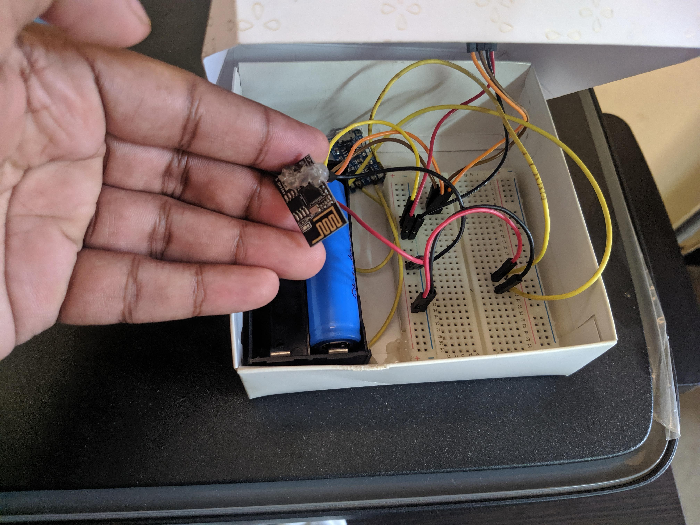
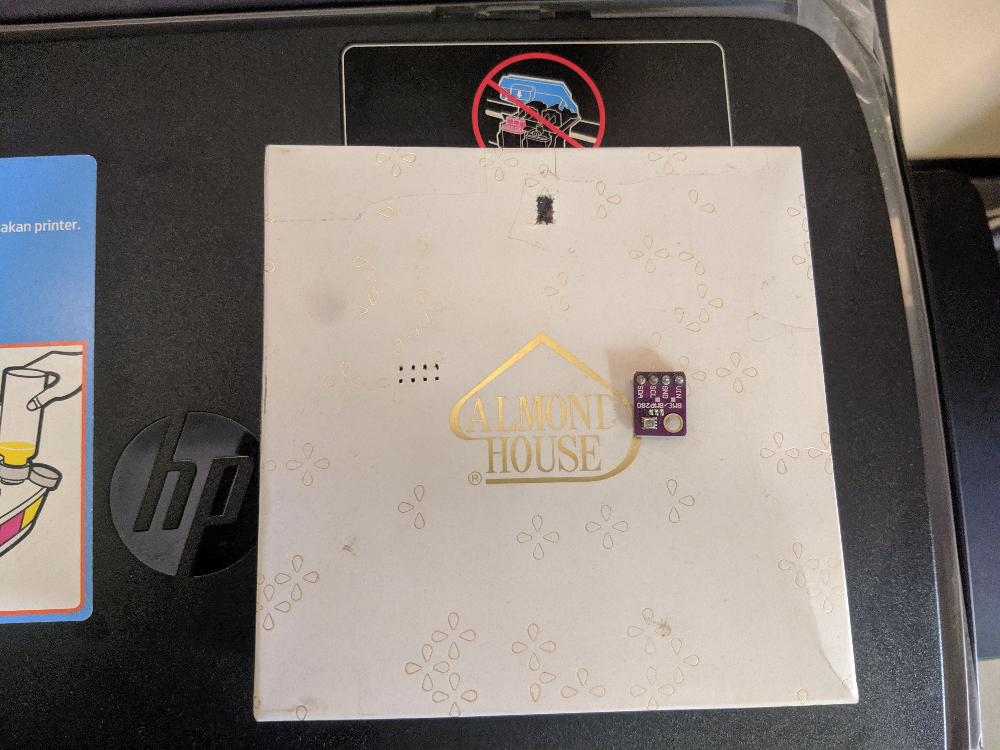

# Temperature-and-Humidity-Tracking
Tracking Temperatur and Humidity using BME/BMP 280 Sensor and DarkSky api, with ESP 01s board and Adafruit IO as Mqtt Server.
The esp8266 takes reading every 10 min and goes to deepsleep to save battery.

